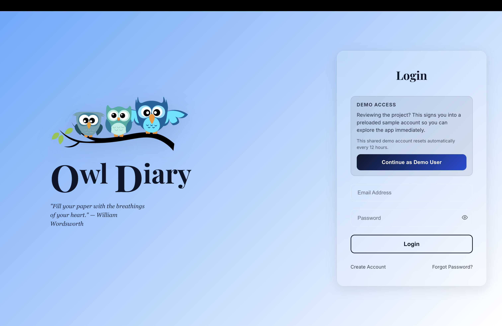
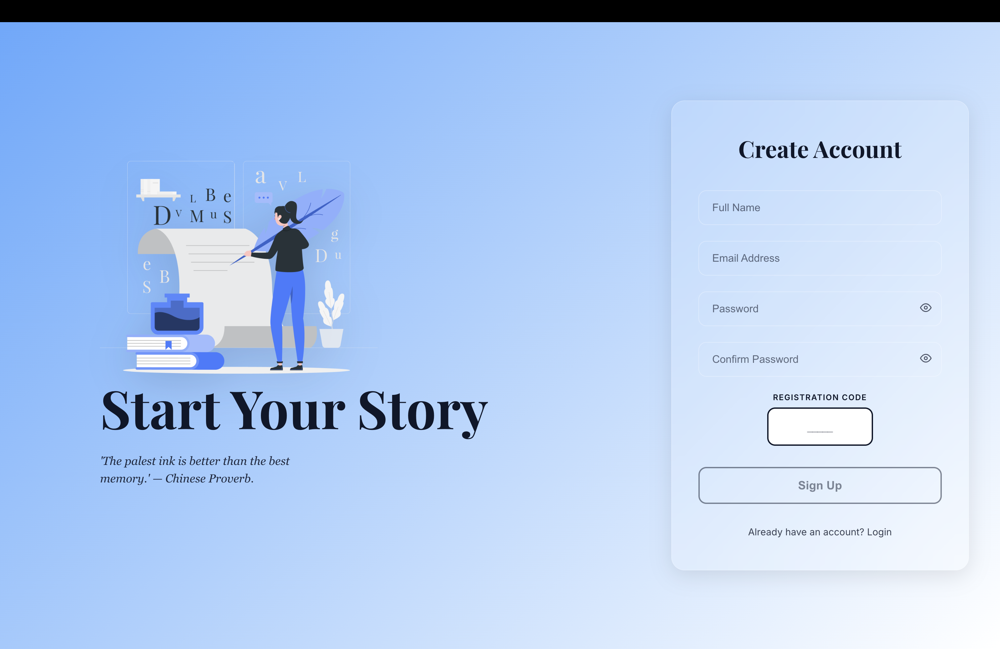
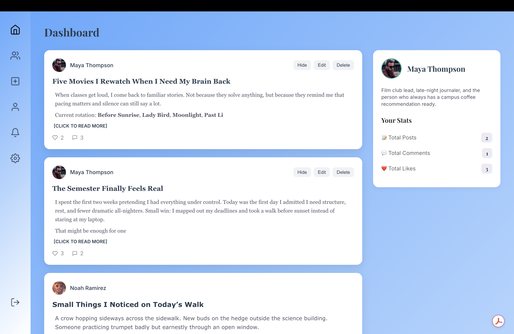
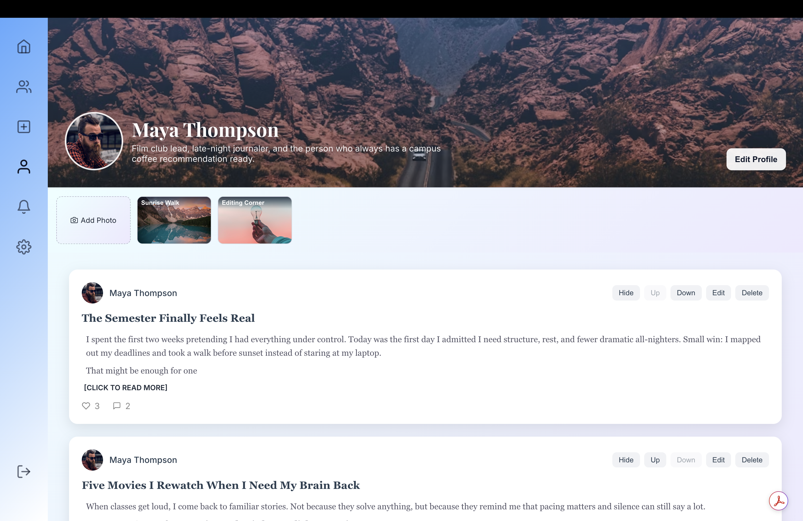
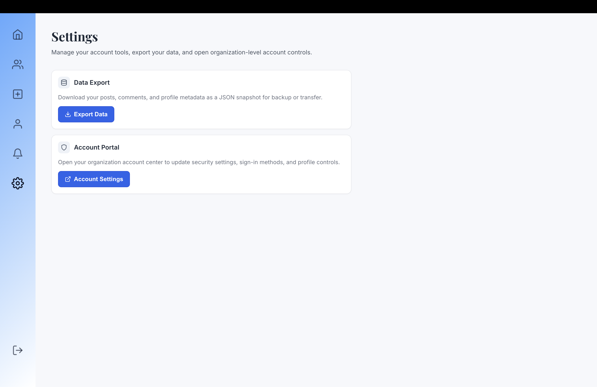

# OwlDiary

OwlDiary is a full-stack social journaling platform built as a university capstone project. It gives students a shared digital space to publish reflections, share blog-style posts, personalize their profiles, and engage with one another through likes, comments, notifications, and moderated community features.

## Live Demo

https://owl-diary.vercel.app

## About This Repository

This public repository is a portfolio showcase for OwlDiary. It includes a project overview, screenshots, and product highlights.

The full source code is not included here.

## Highlights

- Registration-code-based signup for controlled onboarding
- Admin approval workflow for new users
- Rich-text diary and blog-style posting
- Likes, comments, and in-app notifications
- Personalized user profiles with themes, typography, accent colors, and profile backgrounds
- Profile gallery support for visual customization
- Settings tools including account management and data export
- Full-stack deployment across hosted frontend, backend, and database services

## Tech Stack

- React
- Vite
- Express.js
- PostgreSQL
- Node.js
- styled-components
- JWT authentication
- Multer

## Screenshots

### Login

### Create Account

### Dashboard

### Profile

### Settings

## Project Focus

OwlDiary was built to demonstrate practical software engineering through a polished, user-facing full-stack application. The focus was on shipping meaningful interactivity, role-aware permissions, media handling, and deployable infrastructure rather than a static prototype.

## Context

OwlDiary was created as a university capstone project. The official class version is hosted separately for course use. This version is maintained as a live portfolio demo to showcase the product experience, engineering work, and design direction.
